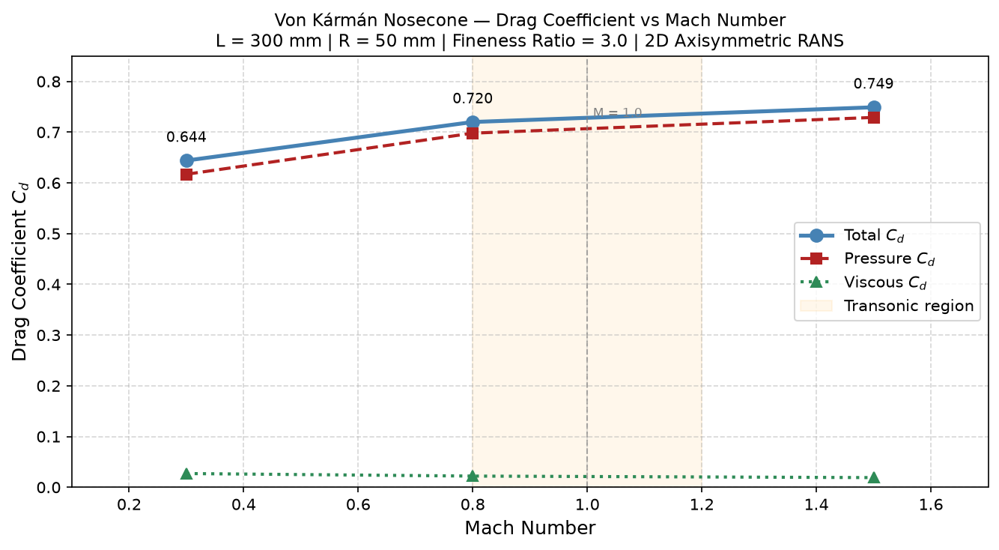

# Von Kármán Nosecone — Compressible Flow CFD Study


A full end-to-end CFD investigation of compressible external aerodynamics over a **Von Kármán (LD-Haack) nosecone** at Mach 0.3, 0.8, and 1.5 — built as part of a personal aerospace engineering portfolio targeting F1 and space industry internship applications.

---

## Overview

The Von Kármán nosecone is the theoretically optimal shape for minimum wave drag at a given length and base diameter. This project applies 2D axisymmetric RANS simulation to quantify its drag performance across subsonic, transonic, and supersonic regimes — covering the full speed envelope of a typical sounding rocket ascent.

The entire pipeline was built from scratch:

- **Geometry** generated parametrically in Python using the LD-Haack equations and imported into ANSYS SpaceClaim via the scripting API (V261)
- **Mesh** built in ANSYS Meshing with structured face meshing and near-wall inflation layers
- **Solver** configured in ANSYS Fluent 2026 R1 with density-based RANS, Spalart-Allmaras turbulence model, and Roe-FDS flux scheme
- **Results** extracted via force reports and post-processed into a Cd vs Mach plot in Python

---

## Key Results

| Case | Pressure Drag (N) | Viscous Drag (N) | Total Drag (N) | **Cd (Total)** |
|------|:-----------------:|:----------------:|:--------------:|:--------------:|
| Mach 0.3 | 30.88 | 1.35 | 32.23 | **0.644** |
| Mach 0.8 | 248.47 | 7.87 | 256.34 | **0.720** |
| Mach 1.5 | 912.56 | 24.18 | 936.74 | **0.749** |

> Reference area: π × R² = 7.854 × 10⁻³ m² | Reference velocity: M × 340 m/s



**Three key findings:**
1. Drag rise is steepest between Mach 0.3 and 0.8 (ΔCd = 0.076) — transonic drag rise signature
2. Pressure drag accounts for 95–97% of total drag across all cases — skin friction is secondary
3. A detached normal bow shock forms at Mach 1.5, visible in pressure and Mach number contours

---

## Nosecone Geometry

The Von Kármán (LD-Haack) profile is defined parametrically as:

```
x = (L / π) · (θ − sin(2θ) / 2)
r = R · √(θ / π)       where θ ∈ [0, π]
```

| Parameter | Value |
|-----------|-------|
| Profile | Von Kármán (LD-Haack Series) |
| Length (L) | 300 mm |
| Base Radius (R) | 50 mm |
| Fineness Ratio (L/D) | 3.0 |
| Profile Points | 500 |

---

## Simulation Setup

### Mesh

| Parameter | Value |
|-----------|-------|
| Mesh Type | Structured Face Meshing |
| Total Nodes | 9,868 |
| Total Elements | 18,362 |
| Min. Orthogonal Quality | 0.637 |
| Max. Skewness | 0.682 |
| Inflation Layers | 5 (growth rate 1.2) |

### Solver

| Setting | Value |
|---------|-------|
| Solver | Density-Based (coupled) |
| Mode | 2D Axisymmetric, Steady-State |
| Turbulence Model | Spalart-Allmaras (1-eqn) |
| Density Model | Ideal Gas |
| Viscosity | Sutherland |
| Flux Scheme | Roe-FDS |
| Discretisation | Second Order Upwind |
| Free-stream Temperature | 300 K |
| Courant Number | 1.0 |

### Boundary Conditions

| Boundary | Type | Setting |
|----------|------|---------|
| Inlet | Pressure Far-Field | Mach per case, T = 300 K |
| Farfield (top) | Pressure Far-Field | Mach per case, T = 300 K |
| Outlet | Pressure Outlet | Gauge P = 0 Pa |
| Symmetry Axis | Axis | — |
| Nosecone Wall | Wall (no-slip) | — |

---

## Repository Structure

```
nosecone-cfd/
├── geometry/
│   ├── vonkarman_profile.py      # Parametric profile generator (Python)
│   ├── vonkarman_profile.csv     # 500-point coordinate export
│   └── vonkarman_profile.png     # Profile visualisation
├── mesh/
│   └── mesh_screenshot.png       # Mesh visualisation
├── solver/
│   ├── case_mach03/              # Mach 0.3 case files
│   ├── case_mach08/              # Mach 0.8 case files
│   └── case_mach15/              # Mach 1.5 case files
├── results/
│   ├── plots/
│   │   ├── cd_vs_mach.png        # Drag coefficient vs Mach plot
│   │   ├── mach03_pressure.png
│   │   ├── mach03_velocity.png
│   │   ├── mach03_mach_number.png
│   │   ├── mach08_pressure.png
│   │   ├── mach08_velocity.png
│   │   ├── mach08_mach_number.png
│   │   ├── mach15_pressure.png
│   │   ├── mach15_velocity.png
│   │   └── mach15_mach_number.png
│   └── plot_results.py           # Cd vs Mach plot generator
├── report/
│   └── vonkarman_nosecone_cfd_report_v2.docx
├── .gitignore
├── LICENSE
└── README.md
```

---

## How to Reproduce

### 1. Generate the Nosecone Profile

```bash
cd geometry
python vonkarman_profile.py
```

Outputs `vonkarman_profile.csv` (500 coordinate pairs) and `vonkarman_profile.png`.

### 2. Build Geometry and Mesh

- Open ANSYS Workbench 2026 R1 → Add **Fluid Flow (Fluent)** system
- Open SpaceClaim → run the profile import script via **File → Scripting → Open Script Editor**
- Build the flow domain boundary lines using the domain script
- Fill the enclosed region using **Design → Fill**
- Assign named selections: inlet, outlet, farfield, symmetry (axis type), wall
- Open Meshing → apply structured face meshing, element size 0.02 m, 5 inflation layers

### 3. Run Simulations

In ANSYS Fluent 2026 R1:

```
Solver:          Density-Based
Models:          Energy ON, Spalart-Allmaras
Materials:       Air — Ideal Gas density, Sutherland viscosity
Boundary inlet:  Pressure Far-Field — set Mach number per case
Methods:         Roe-FDS, Second Order Upwind
Courant Number:  1.0
Iterations:      3000 per case
```

Run all three Mach cases and save each with **File → Export → Case & Data** before changing boundary conditions.

### 4. Post-Processing

```bash
cd results
python plot_results.py
```

Force coefficients extracted via **Results → Reports → Forces** with force direction (1, 0, 0).

---

## Known Limitations

- Mesh skewness of 0.682 at far-field corners may introduce localised numerical diffusion
- Spalart-Allmaras model does not capture shock-boundary layer interaction as accurately as k-ω SST
- Steady-state assumption does not resolve unsteady wake dynamics at the nosecone base
- ANSYS Student Edition 512k cell limit constrains mesh resolution

---

## What's Next

This project is part of a 12-month aerospace portfolio. Next phases:

| Phase | Project | Target |
|-------|---------|--------|
| Phase 1b | XFLR5 Aerofoil Study | F1 Aerodynamics |
| Phase 2 | F1 Front Wing Ground Effect CFD | F1 Internships |
| Phase 3 | 6-DOF Flight Simulation (Python) | Space / SpaceX |
| Phase 4 | CubeSat Subsystem Design | ESA Internships |

---

## Author

**Omgbrumaye Praise** — Aerospace Engineering Student, Lagos State University (LASU)  
Editorial Lead, Space Club LASU  

[](https://linkedin.com/in/your-profile)
[](https://github.com/Praise1417)

---

## License

MIT License — see [LICENSE](LICENSE) for details.
